# nowcoder
### community project of imitation nowcoder

###  仿牛论坛区项目

- **项目地址**：https://github.com/shgang97/nowcoder

- **技术选型**：SpringBoot+SpringMVC+Mybatis+MySQL+Redis+kafka+elasticsearch+SpringSecuritythymleaf

- **项目描述**：本项目是一个社区论坛项目，支持发帖、评论、私信、关注、点赞、加精、置顶、删帖等功能。采用微服务架构的思想，主要涉及模块有权限模块、核心模块、性能模块、通知模块、搜素模块和其他模块。完成了各功能模块后端代码编写，使用Redis存储用户登录信息，提高响应速度，使用Kafka实现异步推送系统通知，使用elasticsearch实现社区搜索功能，使用SpringSecurity实现权限控制。

## 项目开发步骤

### 一、社区登录模块

1. 自动发送邮件：用于激活注册账号
2. 开发注册功能
3. 生成验证码
4. 开发登录功能、退出功能
5. 显示登录信息
6. 账号设置：修改头像、密码
7. 检查登录状态
   - 使用拦截器：通过自定义注解加在需要拦截的方法上

### 二、发布帖子模块

1. 实现敏感词过滤：基于前缀树实现一个敏感词的过滤器
1. 发布帖子
1. 展示帖子详情
1. 显示评论、添加评论
1. 发送私信、显示私信
1. 统一异常处理
1. 统一记录日志功能：基于SpringAop

### 三、点赞、关注

### 四、系统消息推送

### 五、搜索模块

1. 发布帖子时，使用kafka的发布订阅实现将帖子信息存入elasticsearch
2. 从elasticsearch中搜索帖子信息

### 六、权限、网站数据统计、热帖排行

1. 使用spring security实现权限控制：需要登录才能访问权限；管理员加精、置顶权限；版主删帖权限

2. 网站数据统计：使用redis的hyperloglog统计uv，使用bitmap统计dau
3. 热帖排行：使用quartz的任务调度定时计算帖子分数，根据分数对帖子进行排序展示

## 项目效果展示

### 一、社区首页

实现首页分页功能

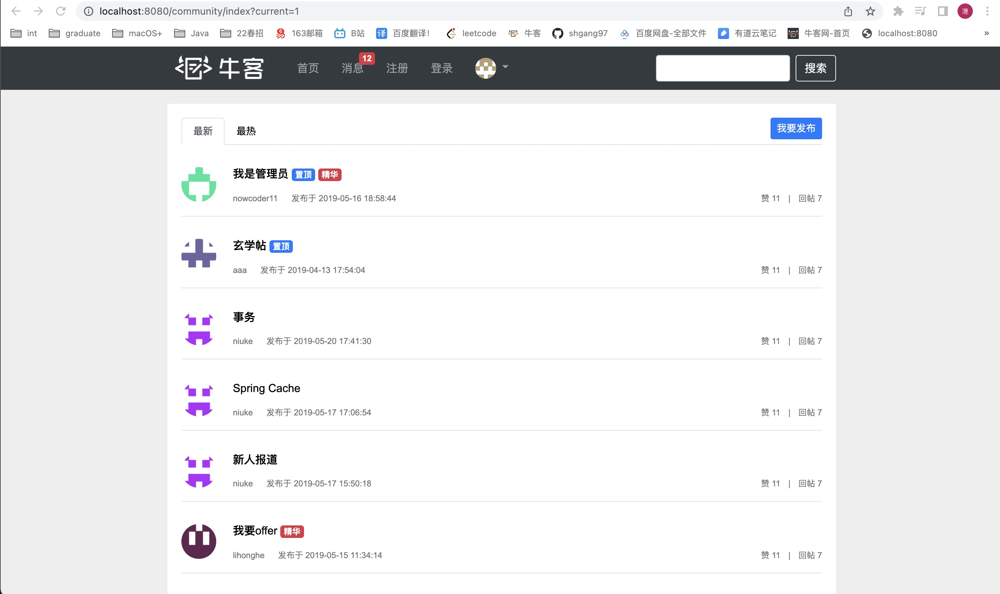

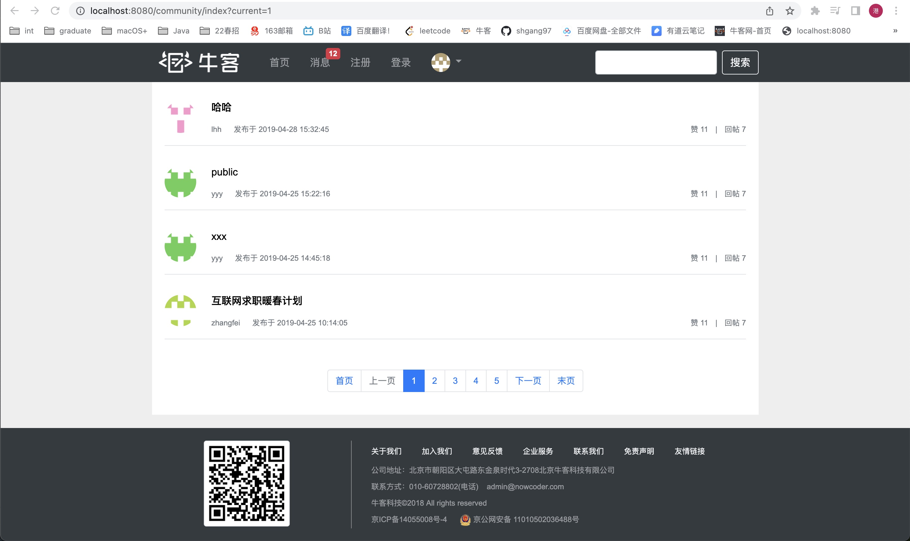

### 二、登录模块

1. 开发注册功能

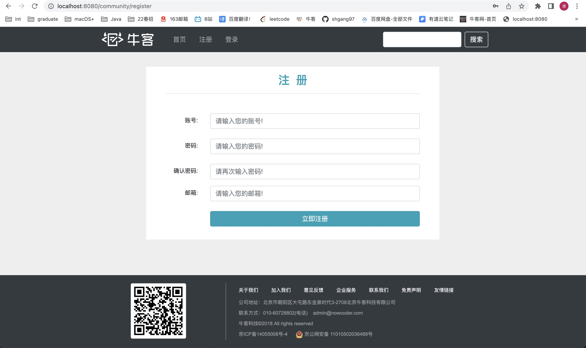

2. 开发登录功能

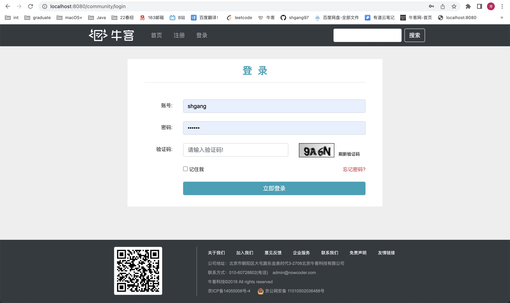

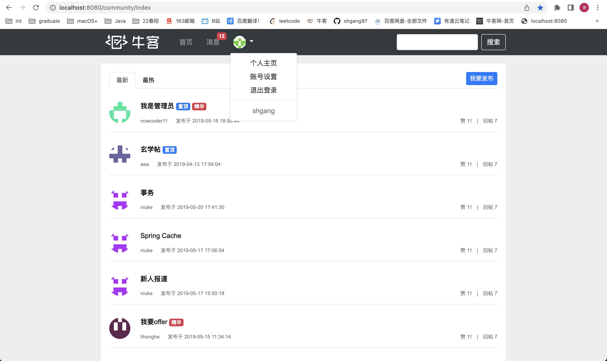

### 三、发布帖子模块

1. 发布帖子

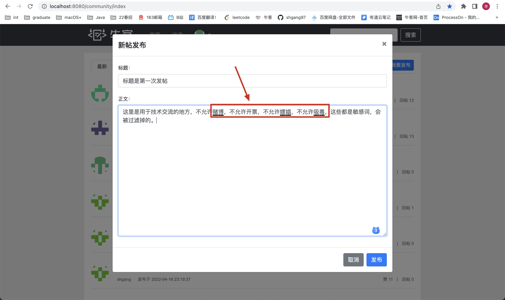

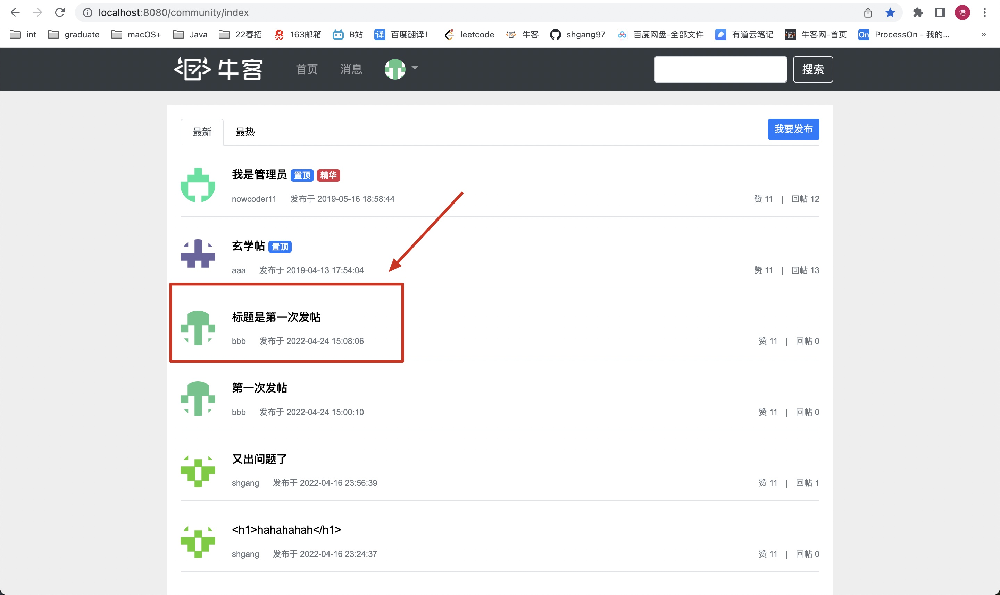

2. 展示帖子详情

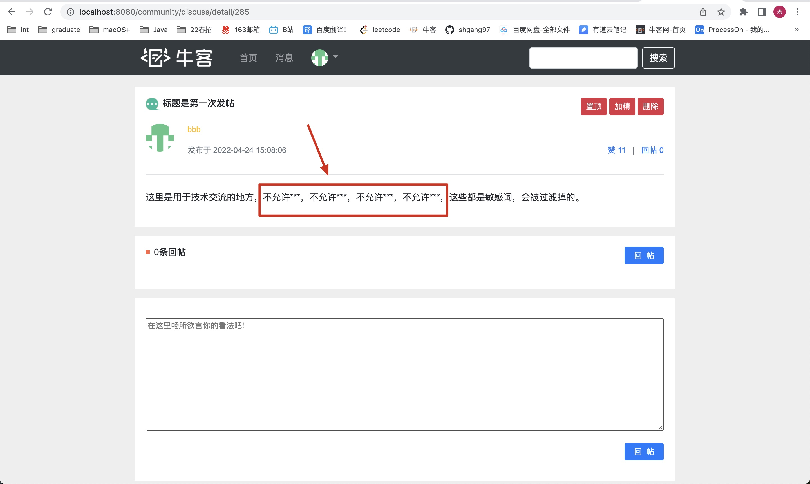

3. 发表评论、显示评论

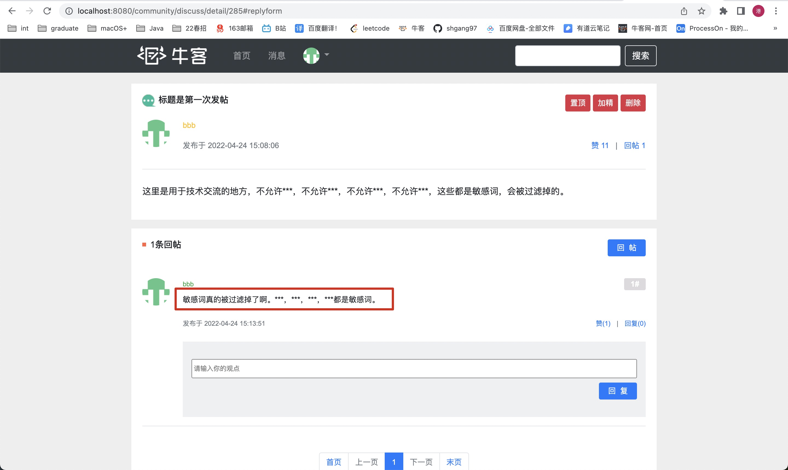

3. 发送私信、查看私信

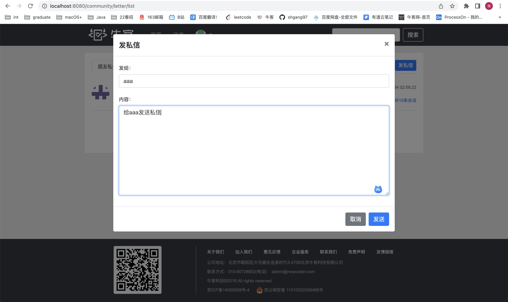

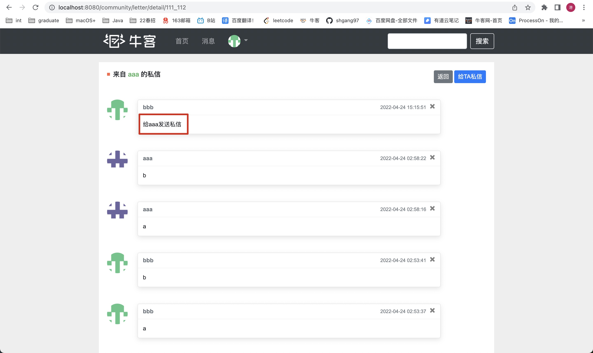

4. 统一记录日志

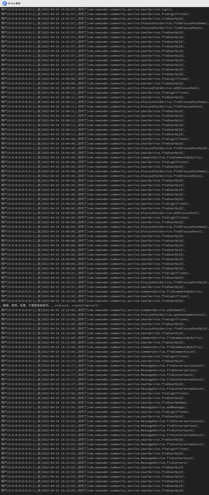

### 六、搜索模块

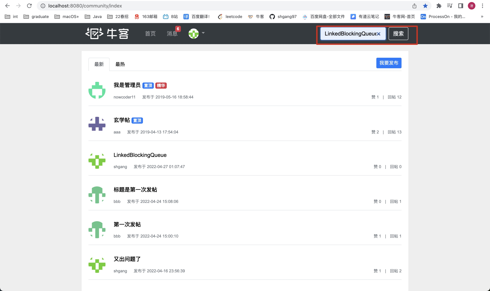

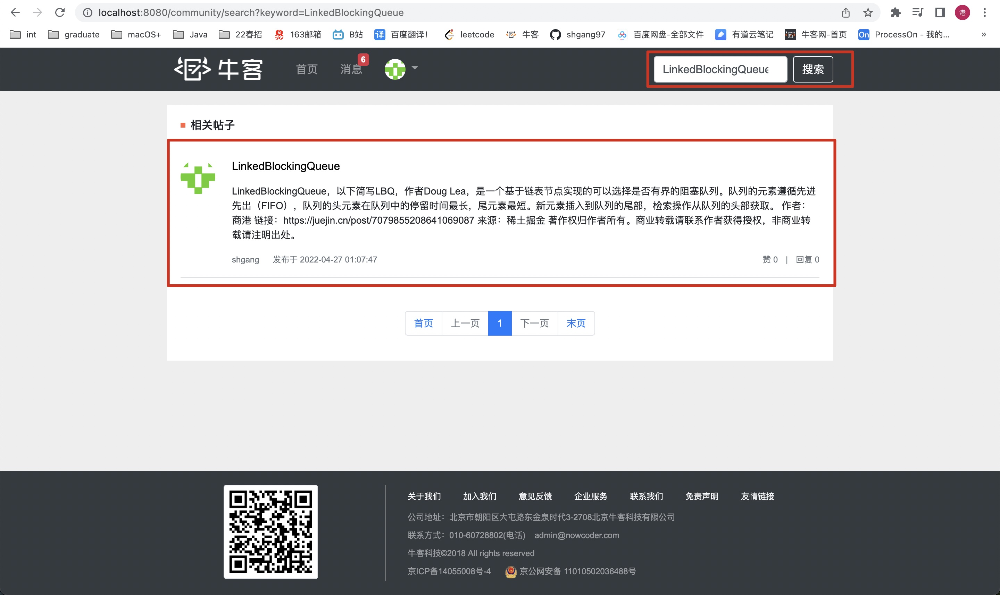
